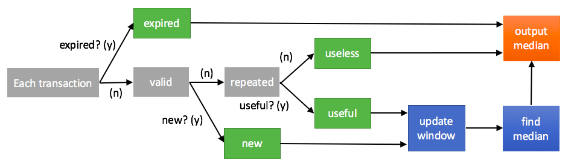

##Quick Navigation

1. [Input and Output] (README.md#input-and-output)

2. [Required Packages] (README.md#required-packages)

3. [Repo directory structure] (README.md#repo-directory-structure)

4. [Solution] (README.md#solution)

5. [Analysis] (README.md#analysis)

##Input and Output

[Back to Table of Contents] (README.md#quick-navigation)

    Input: a text file containing bunch of transaction datas (with regulated format). 

    Output: a text file named 'output.txt' in the 'venmo_output' directory.

##Required Packages

[Back to Table of Contents] (README.md#quick-navigation)

    (a) sys - for file reading and writing.

    (b) datetime - to deal with time format that contained in input file.

    (c) numpy - to seek the median.

    Numpy costs O(nlogn) in time, and it can be improved into O(n) by implementing "selection algorithm". 

##Repo directory structure

[Back to Table of Contents] (README.md#quick-navigation)

Repo Structure

	├── README.md 
	├── run.sh
	├── src
	│  	└── rolling_median_YJL.py
	├── venmo_input
	│   ├── test.txt
    │   └── venmo-trans.txt
	├── venmo_output
	│   └── output.txt
	└── insight_testsuite
	 	   ├── run_tests.sh
		   └── tests
	        	└── test-1-venmo-trans
        		│   ├── venmo_input
        		│   │   └── venmo-trans.txt
        		│   └── venmo_output
        		│       └── output.txt
        		└── temp
            		 ├── venmo_input
            		 │	  └── venmo-trans.txt
            		 └── venmo_output
            			  └── output.txt

##Solution

[Back to Table of Contents] (README.md#quick-navigation)

The transaction is read as following format (with some trick):
[ seconds, person_of_interest_a, person_of_interest_b]

With reference time (e.g. time of first transaction), the 'created_time' can be converted into "seconds to reference time".
Next, the order of "actor" and "target" is irrevalant in this challenge. (Transaction from a to b and from b to a is the same.) So we sort them here to avoid "a-b" <-> "b-a" problem.

We use class Node() to store:

    1. the name of node
    2. the neighbors(edges) of this node, and the corresponding expiring time of each neighbor (edge).
    3. the number of connected edge of this node

We use two lists:

    1. graph - to store nodes (and edges) that are not expired.
    2. window - to store "non-repetitive" transactions that are not expired yet.

Flow chart is shown as follows:

Grey: unknown status
Green: status for sure (new edges are added now if needed).
Blue: actions that take place only when necessary
Orange: output the median

It's actually quite straight forward.

For each newly arrived transaction, steps in flow chart are illustrated as follows:

    1. Check the transaction time and repetitivity to classify into four (green) status:
        a. expired: this transaction can be ignored.
        b. repetitive but useless: this transaction is repetitive, but it's older than current existing one.
        c. repetitive but useful: this transaction came later than current existing one.
        d. new: this transaction never happened before, add this edge in graph.

        Note that for b. and c., no need to build new edge. But it's required to update expiring time in current edge.

    2. According to its status, following actions may be necessary:
        a. update the window:
            (1) kick expired transaction out of window, and 
            (2) cut expired edges in the graph: it took place right after window is updated.
        b. find new median: only if the graph has changed.

        In some situation these actions are not needed.

    3. Just output the median.

##Analysis

[Back to Table of Contents] (README.md#quick-navigation)

If there's n nodes in graph, m unique transactions in 60s-window, then:

Each transaction involves two persons of interest.

The minimum nodes in the graph will satisfy: m = n(n-1)/2 => n ~= sqrt(2m)

The maximum nodes in the graph will be n = 2m

Space complexity:

O(m) + O(n) (60s-window + graph)

Time complexity:

Consider the worst case

O(n) + O(n) + O(2*delta-m)*O(n) + O(nlogn)
(find duplicity + comprare repetition + update window + find new median)

The O(mlogm) for update window includes:

    1. Kick out expired transactions, number = delta-m
    2. Fix nodes that involved in expired transactions, number of nodes = 2*(delta-m). It's from O(1) to O(n) to get a key and delete it in python. Worst case: O(2*delta-m)*O(n)

According to [here] (https://github.com/numpy/numpy/issues/1811), Numpy uses quicksort which is O(nlogn) on average. It can be improved into O(n).

Therefore, time complexity should be O(nlogn) and can be improved if we applied "Selection algorithm"

